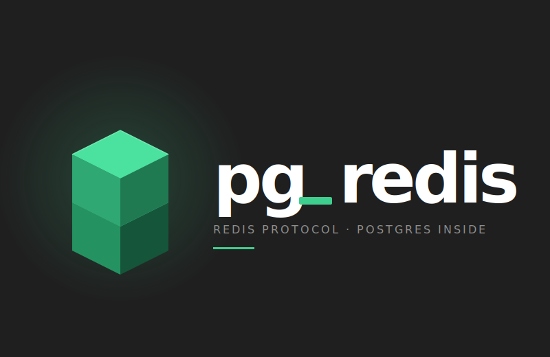

<div align="center">
  
</div>

A PostgreSQL extension that lets you connect to Postgres using the **Redis protocol (RESP2)**. Drop-in Redis wire compatibility backed by real SQL tables — with two durability modes to match your performance needs.

Built with [pgrx](https://github.com/pgcentralfoundation/pgrx) in Rust.

## How it works

`pg_redis` starts a pool of TCP background workers inside PostgreSQL that listen for Redis clients on port 6379. Incoming RESP2 commands are parsed and translated to SPI queries against regular PostgreSQL tables inside the `redis` schema, **or** handled entirely in shared memory with no transaction overhead.

Data is stored across 16 databases (0–15), mirroring Redis's native database model. Even-numbered databases (default) use shared-memory hash tables with no transaction overhead. Odd-numbered databases use WAL-logged PostgreSQL tables for durability and SQL visibility.

## Quick start

```bash
redis-cli -p 6379

127.0.0.1:6379> SET greeting "hello from postgres"
OK

127.0.0.1:6379> GET greeting
"hello from postgres"

127.0.0.1:6379> SET session:token abc123 EX 3600
OK
```

To use a durable, SQL-visible database, switch to an odd-numbered db:

```bash
127.0.0.1:6379> SELECT 1
OK
127.0.0.1:6379> SET greeting "hello from postgres"
OK
```

```sql
SELECT key, value, expires_at FROM redis.kv_1;
```

## Documentation

Full docs at **[filipecabaco.github.io/pg_redis](https://filipecabaco.github.io/pg_redis/)**.

- [Installation](./docs/installation.md) — requirements, building from source, enabling the extension
- [Configuration](./docs/configuration.md) — GUC reference, database selection, worker management
- [Commands](./docs/commands.md) — supported Redis commands
- [Storage modes](./docs/storage-modes.md) — in-memory mode, logged vs unlogged tables
- [Pub/Sub table routing](./docs/pubsub.md) — routing PUBLISH to PostgreSQL tables
- [Benchmarks](./docs/benchmarks.md) — performance results and batch size tuning
- [Development](./docs/development.md) — running tests, local dev workflow, schema
